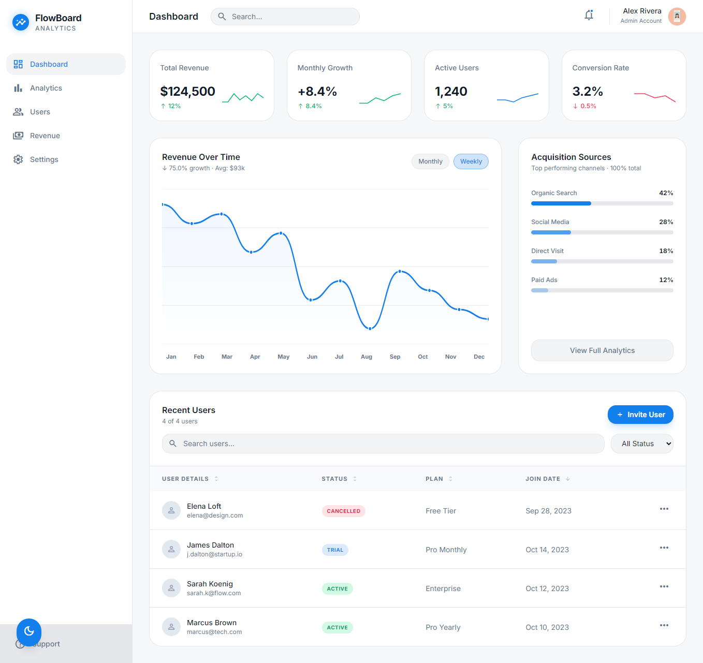
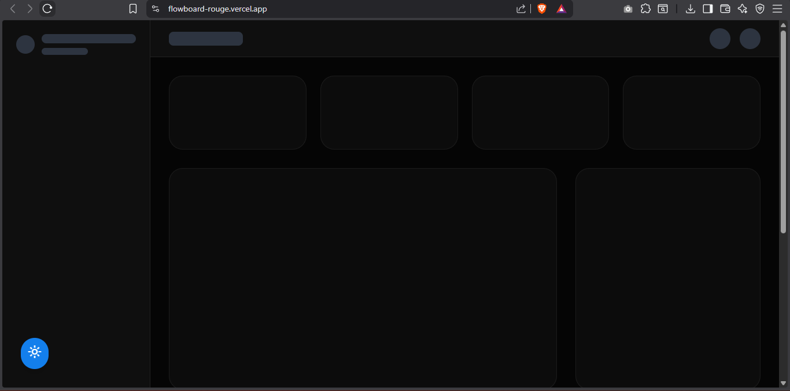

# 🎯 FlowBoard - Modern Analytics Dashboard

> Production-ready SaaS dashboard with real-time data fetching, built with React 18, TypeScript, and TailwindCSS

[](https://flowboard-rouge.vercel.app)
[](https://www.typescriptlang.org/)
[](https://reactjs.org/)
[](https://tailwindcss.com/)

[🚀 Live Demo](https://flowboard-rouge.vercel.app) • [📧 Contact](nadiaescobbb@gmail.com) • [💼 LinkedIn](https://www.linkedin.com/in/nadiaescobbb/)

---

## 📸 Preview

### Light Mode


### Dark Mode


### Mobile Responsive


### Loading States


---

## ✨ Key Features

### 🎨 **Professional UI/UX**
- Sleek, modern design with attention to detail
- Smooth transitions and micro-interactions
- Light/Dark theme with persistent preferences
- Fully responsive (mobile-first approach)

### ⚡ **Performance Optimized**
- React Query for efficient data fetching and caching
- Memoized components with `useMemo` and `useCallback`
- Code splitting and lazy loading ready
- Optimized bundle size (~55KB gzipped)

### 📊 **Interactive Dashboard**
- Real-time KPI cards with trend indicators
- Custom-built SVG charts (no heavy chart libraries)
- Sortable and filterable user table
- Hover states and tooltips on charts

### 🛡️ **Production Ready**
- TypeScript for type safety
- Error boundaries for graceful error handling
- Loading skeletons for better UX
- Accessible (ARIA labels, semantic HTML, keyboard navigation)

---

## 🛠️ Tech Stack

| Category | Technologies |
|----------|-------------|
| **Frontend** | React 18, TypeScript, Vite |
| **Styling** | TailwindCSS, CSS Variables |
| **State Management** | React Query, Context API |
| **Data Fetching** | React Query (TanStack Query) |
| **Charts** | Custom SVG implementations |
| **Icons** | Material Symbols (Google) |
| **Deployment** | Vercel (CI/CD) |

---

## 🚀 Quick Start

### Prerequisites
- Node.js 18+ 
- npm or yarn

### Installation
```bash
# Clone repository
git clone https://github.com/nadiaescobbb/flowboard-dashboard.git
cd flowboard-dashboard

# Install dependencies
npm install

# Start development server
npm run dev
```

Visit `http://localhost:5173` 🎉

### Build for Production
```bash
npm run build
npm run preview
```

---

## 📁 Project Structure
```
flowboard/
├── src/
│   ├── api/              # API layer with React Query
│   ├── components/       # Reusable UI components
│   │   ├── AcquisitionChart.tsx
│   │   ├── DashboardSkeleton.tsx
│   │   ├── ErrorState.tsx
│   │   ├── KPICard.tsx
│   │   ├── RevenueChart.tsx
│   │   └── UserTable.tsx
│   ├── contexts/         # React Context providers
│   │   └── ThemeContext.tsx
│   ├── hooks/            # Custom React hooks
│   │   ├── useDashboardData.ts
│   │   └── useThemeClasses.ts
│   ├── pages/            # Page components
│   │   └── Dashboard.tsx
│   ├── types/            # TypeScript type definitions
│   └── data/             # Mock data (for demo)
├── public/               # Static assets
└── screenshots/          # Project screenshots
```

---

## 🎨 Design System

### Color Palette
```css
/* Primary */
--primary: #137fec

/* Light Theme */
--background-light: #f6f7f8
--surface-light: #ffffff
--text-primary-light: #0f172a

/* Dark Theme */
--background-dark: #050505
--surface-dark: #0f0f0f
--text-primary-dark: #ffffff
```

### Typography
- **Font**: Inter (Google Fonts)
- **Weights**: 400, 500, 600, 700

---

## 🧪 Key Implementation Highlights

### 1. **React Query Integration**
```typescript
export function useDashboardData() {
  return useQuery({
    queryKey: ['dashboard', theme],
    queryFn: () => fetchDashboardData(theme),
    staleTime: 5 * 60 * 1000,
    retry: 2,
  });
}
```

### 2. **Custom SVG Charts**
Built from scratch without chart libraries - full control over styling and interactions.

### 3. **Theme System**
Persistent theme with CSS variables and Context API.

### 4. **Performance Optimizations**
- Memoized expensive calculations
- Debounced search inputs
- Virtualized lists for large datasets (ready to scale)

---

## 🎓 What I Learned

- **React Query** for server state management
- Building **custom SVG visualizations** from scratch
- Implementing **skeleton loading states** for better UX
- Creating a **scalable theme system** with CSS variables
- **TypeScript** best practices for React applications
- **Performance optimization** techniques (memoization, code splitting)

---

## 🚧 Future Enhancements

- [ ] Backend API integration (currently using mock data)
- [ ] User authentication with JWT
- [ ] Real-time updates with WebSockets
- [ ] Advanced filtering and search
- [ ] Export to PDF/CSV functionality
- [ ] Unit tests with Vitest
- [ ] E2E tests with Playwright

---

## 📝 License

This project is part of my professional portfolio.  
© 2024 Nadia. All rights reserved.

---

## 🤝 Connect With Me

- 💼 [LinkedIn](https://www.linkedin.com/in/nadiaescobbb/)
- 🌐 [Portfolio](tu-portfolio)
- 📧 [Email](nadiaescobbb@gmail.com)
- 🐙 [GitHub](https://github.com/nadiaescobbb)

---

<div align="center">
  <strong>⭐ If you found this project interesting, please consider giving it a star!</strong>
</div>