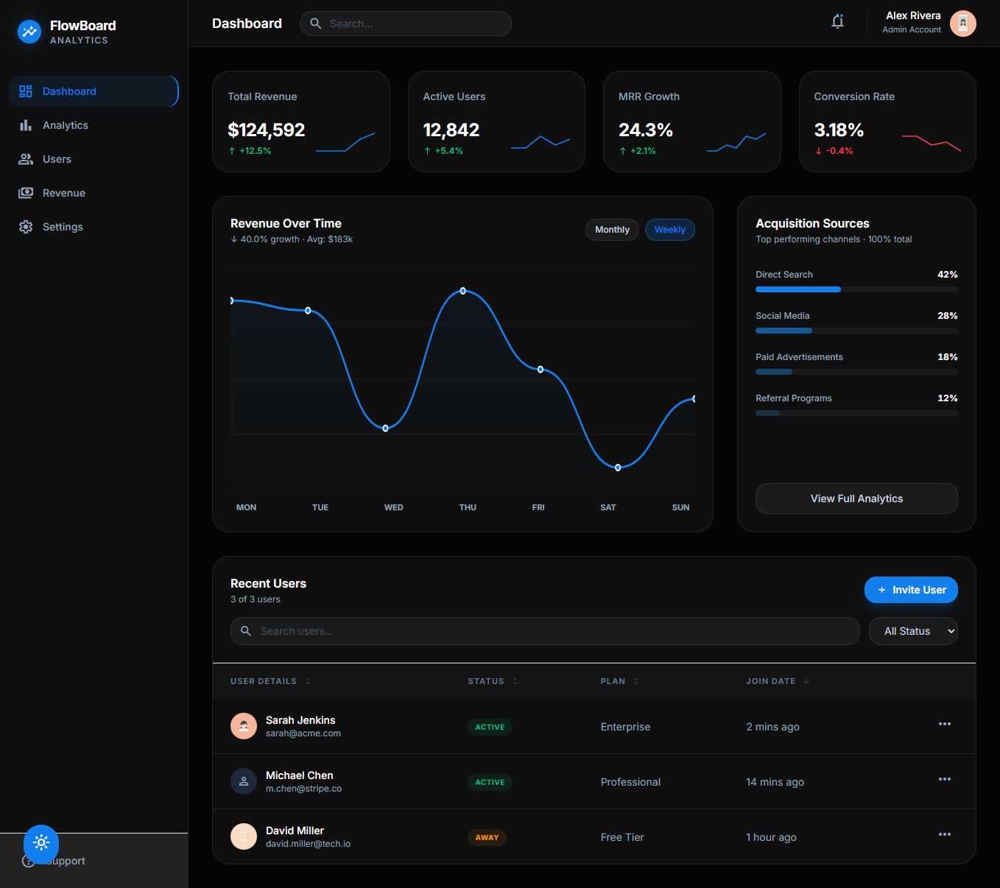

# 🎯 FlowBoard - Modern Analytics Dashboard

> Production-ready SaaS dashboard built with React, TypeScript, and TailwindCSS

[🚀 Live Demo](https://flowboard-rouge.vercel.app/) | [📹 Video Demo](link)




## ✨ Features

- 📊 **Real-time Analytics** - Interactive charts with hover states
- 🎨 **Theme System** - Light/Dark mode with smooth transitions
- 📱 **Fully Responsive** - Mobile-first design
- ⚡ **Optimized Performance** - React Query + memoization
- ♿ **Accessible** - ARIA labels, keyboard navigation
- 🔐 **Type-Safe** - 100% TypeScript coverage

## 🛠️ Tech Stack

- **Frontend**: React 18, TypeScript, Vite
- **Styling**: TailwindCSS, CSS Variables
- **State**: React Query, Context API
- **Charts**: Custom SVG (no heavy libraries)
- **Icons**: Material Symbols

## 🚀 Quick Start
```bash
# Install
npm install

# Run dev
npm run dev

# Build
npm run build
```

## 📸 Screenshots

### Desktop View


### Mobile View


## 🏗️ Architecture
```
src/
├── components/     # Reusable UI components
├── contexts/       # React Context providers
├── hooks/          # Custom hooks
├── api/            # API layer with React Query
└── types/          # TypeScript definitions
```

## 🎓 What I Learned

- Implementing real-time data fetching with React Query
- Building custom SVG charts without heavy libraries
- Creating a scalable theme system
- Optimizing renders with useMemo/useCallback

## 🔗 Connect

[LinkedIn](https://www.linkedin.com/in/nadiaescobbb/) | [Portfolio](tu-portfolio)

---

**Built with 💙 by [nadia escobar]**